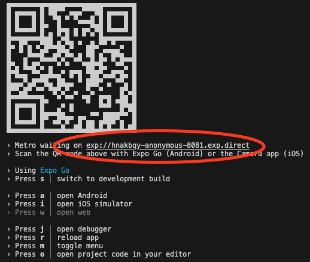
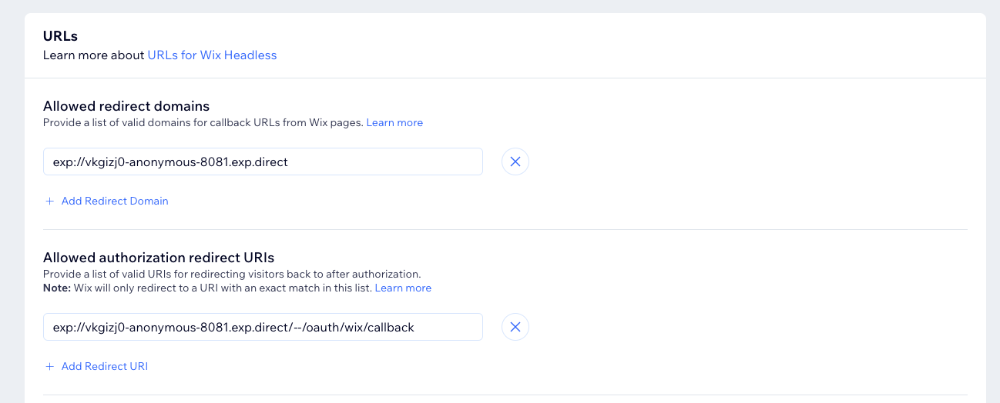

# Handling Member Login

In this guide we'll cover how to handle member login and logout in a React Native application based on Wix Headless. We'll cover the following topics:

- [Handling Member Login](#handling-member-login)
  - [Logging in with Wix Managed Pages](#logging-in-with-wix-managed-pages)
    - [Registering OAuth Redirect Url](#registering-oauth-redirect-url)
    - [Code Example](#code-example)
  - [Building a Custom Login Form](#building-a-custom-login-form)
    - [Secure Custom Login in React Native](#secure-custom-login-in-react-native)
    - [Code Example](#code-example-1)
  - [Handling login/logout inside a checkout redirect session](#handling-loginlogout-inside-a-checkout-redirect-session)
    - [Detecting User Logged In During Redirect Session](#detecting-user-logged-in-during-redirect-session)
      - [Performing a Silent Login](#performing-a-silent-login)
      - [Code Example](#code-example-2)

## Logging in with Wix Managed Pages

Wix Managed Pages are pages that are managed by Wix and are part of the Wix domain. With the Redirect Sessions API, we can easily log in users by navigating the users built in browser to a Wix Login / Signup page and then redirecting them back to our application. Using Wix Managed Pages saves us the need to build a login form and handle the login process ourselves (and automatically supporting features like social login, captcha, error state and more).

> 💡 Using Wix Managed Pages for user login / signup is recommended for most use cases. It's a secure and easy way to log in users to your application, and saves a lot of development effort required for a production ready member login solution.

To perform a login with Wix Managed Pages, we'll use the APIs available on the `OAuthStartegy` to generate a url for the Wix OAuth /authorize endpoint and then open it using the `expo-web-browser` package. For our OAuth redirect url we'll use a deep link (with `expo-linking`) that will be handled by our application and will finish the OAuth process by exchanging the `code` and `state` params for member tokens. For secure storage of our oauth data, we'll use the `expo-secure-store` package.

> 📚 Learn more about the expo packages we use:
>
> - [expo-web-browser](https://docs.expo.dev/versions/latest/sdk/webbrowser/)
> - [expo-linking](https://docs.expo.dev/versions/latest/sdk/linking/)
> - [expo-secure-store](https://docs.expo.dev/versions/latest/sdk/securestore/)

### Registering OAuth Redirect Url

In the OAuth process, we need to provide a redirect url that will be used to finish the OAuth process. Any redirect url we use must be registered in the OAuth App settings in the Wix Dashboard. Since we'll be using a deep link to our mobile application, make sure to register the full url with your custom scheme (e.g. `exp://localhost:19000/oauth/wix/callback`).

The base url for your redirects is printed in the console when you start your app with expo. You can use this url as the base for your redirect urls.

> For the production url you'll need to use the scheme of your app (e.g. `myapp://oauth/wix/callback`), defined in your `app.json`.



The use that url to create the full redirect url for your app (e.g. `exp://localhost:19000/oauth/wix/callback`) and update it in your OAuth App settings in the Wix Dashboard.



### Code Example

> The code for login by using Wix Managed Pages in this app can be found in [MemberHeaderMenu.js](../authentication/MemberHeaderMenu.js) and [LoginHandler.js](../authentication/LoginHandler.js).

We'll start by creating a button that will start the login process by opening the Wix OAuth /authorize endpoint in the users browser. Note that we are using `Linking.createURL` to create a deep link to our application that will be used as the redirect url (should match the redirect url we registered in the Wix Dashboard).

```jsx
import * as React from "react";
import * as WebBrowser from "expo-web-browser";
import * as Linking from "expo-linking";
import { useWixAuth } from "./authentication";

export default function MyLoginButton() {
  const auth = useWixAuth();

  const handleLogin = React.useCallback(async () => {
    const data = auth.generateOAuthData(
      Linking.createURL("/oauth/wix/callback"),
    );
    const { authUrl } = await auth.getAuthUrl(data);
    WebBrowser.openBrowserAsync(authUrl);
  }, [auth]);

  return <Button title="Login" onPress={handleLogin} />;
}
```

Now that we have a button that starts the login process, we need to handle the redirect url in our application. We'll use `Linking.addEventListener` to listen to deep links and handle the callback url that we registered in the Wix Dashboard. Make sure that this code runs in a top level component in your application (e.g. `App.js`).

```jsx
React.useEffect(() => {
  Linking.addEventListener("url", async (event) => {
    if (event.url.startsWith(Linking.createURL("/oauth/wix/callback"))) {
      const oauthData = JSON.parse(
        await SecureStore.getItemAsync("oauthState"),
      );
      const { code, state } = auth.parseFromUrl(event.url);
      const tokens = await auth.getMemberTokens(code, state, oauthData);
    }
  });
}, []);
```

In our event listener, we parsed the url, and then checked if the url is the callback url we registered in the Wix Dashboard. If it is, we parsed the `code` and `state` params from the url and then called `getMemberTokens` to finish the OAuth process and get the member tokens. You can then use the tokens to store the member session in your application.

## Building a Custom Login Form

In some cases, you might want to build a custom login form for your application. This can be useful if you want to provide a more seamless login experience for your users, or if you want to provide a login form that is part of your application's design. In this section we'll cover how to build a custom login form and handle the login process, but this guide is not exhaustive and you'll still need to handle errors, captcha if needed, etc.

### Secure Custom Login in React Native

To provide a secure login process for your application, one that doesn't rely on secrets being exposed in the client, we'll be using Wix OAuth API with PKCE (Proof Key for Code Exchange). PKCE is a security extension to OAuth 2.0 that prevents interception of the authorization code by attackers. It was designed to work with public clients (like mobile and single-page applications) and provides a way to secure the authorization code when it is returned to the client.

For the oauth process to work in a react native app, we'll be using a hidden webview to open the Wix OAuth /authorize endpoint and then listen to the callback deep link to finish the OAuth process. We'll use the `expo-web-view` package to open the webview and listen to the callback deep link. This is similar to the process the Wix SDK uses in browser clients.

### Code Example

> The code for the custom login form in this app can be found in [CustomLoginScreen.js](../store/CustomLoginScreen.js) and [LoginHandler](../authentication/LoginHandler.js).

Before starting out with the custom login form, we'll first build the component that will handle the OAuth process in the hidden `WebView`. This component will provide a function (in React Context) to start the login process, which later our custom login form will use.

```jsx
function LoginHandlerInvisibleWebview(props) {
  const auth = useWixAuth();

  if (!props.loginState) {
    return null;
  } else {
    return (
      <WebView
        source={{ uri: props.loginState.url }}
        originWhitelist={["exp://*"]}
        containerStyle={{ display: "none" }}
        onShouldStartLoadWithRequest={(request) => {
          if (
            request.url.startsWith(Linking.createURL("/oauth/wix/callback"))
          ) {
            const { code, state } = auth.parseFromUrl(
              request.url,
              props.loginState.data,
            );
            auth
              .getMemberTokens(code, state, props.loginState.data)
              .then((tokens) => {
                // store the tokens
                props.setLoginState(null);
              });
            return false;
          }
          return true;
        }}
      />
    );
  }
}
```

The `LoginHandlerInvisibleWebview` component is a non-visible `WebView` that is rendered when a login process is started. It opens with the Wix OAuth /authorize endpoint and listens to the callback deep link to finish the OAuth process. Once the process is finished, it calls `setSession` to store the member session in the application state. The component uses the `loginState` and `setLoginState` props to control when to render the `WebView` and when to hide it.

Now we'll build the component that controls the `LoginHandlerInvisibleWebview` and provides the React Context with the function to start the login process.

```jsx
const LoginHandlerContext = React.createContext(null);

export function useLoginHandler() {
  return React.useContext(LoginHandlerContext);
}

export function LoginHandler(props) {
  const [loginState, setLoginState] = React.useState(null);
  const auth = useWixAuth();

  const login = React.useCallback(
    async (email, password) => {
      const result = await auth.login({
        email,
        password,
      });
      const data = auth.generateOAuthData(
        Linking.createURL("/oauth/wix/callback"),
      );
      const { authUrl } = await auth.getAuthUrl(data, {
        prompt: "none",
        sessionToken: result.data.sessionToken,
      });
      setLoginState({
        url: authUrl,
        data,
      });
    },
    [auth, setSessionLoading],
  );

  return (
    <LoginHandlerContext.Provider value={{ login }}>
      <LoginHandlerInvisibleWebview
        loginState={loginState}
        setLoginState={setLoginState}
      />
      {props.children}
    </LoginHandlerContext.Provider>
  );
}
```

The `LoginHandler` component and the ``useLoginHandler` hook provide a React Context with the `login` function that starts the login process. The `login` function takes an email and password and then calls `auth.login` to get a session token (if succesful! it's important to handle errors here like wrong password, reset password required, etc..). Then it generates the OAuth data and gets the OAuth url with `auth.getAuthUrl` and then sets the `loginState` to start the `WebView` and finish the OAuth process.

> 💡 Note that finishing this process requires the OAuth callback handling logic that can be found in the [Logging in with Wix Managed Pages Code Example](#code-example)

Now that we have the `LoginHandler` component, we can build our custom login form that uses the `useLoginHandler` hook to start the login process.

```jsx
export default function CustomLoginScreen({ navigation }) {
  const { login } = useLoginHandler();
  const [email, setEmail] = React.useState("");
  const [password, setPassword] = React.useState("");

  const handleLogin = React.useCallback(async () => {
    await login(email, password);
    navigation.navigate("Home");
  }, [login, email, password]);

  return (
    <View>
      <TextInput value={email} onChangeText={setEmail} placeholder="Email" />
      <TextInput
        value={password}
        onChangeText={setPassword}
        placeholder="Password"
        secureTextEntry
      />
      <Button title="Login" onPress={handleLogin} />
    </View>
  );
}
```

## Handling login/logout inside a checkout redirect session

When performing a checkout, we are opening a `WebView` and navigating to the checkout redirect session url. If there is no currently logged in member to the application (meaning we are acting as a Visitor) the user will have the ability to login as a member while inside the checkout session. This allows users to easily fill out the billing and shipping information if they are returning customers (their details would be filled in automatically once logged in).

When a user logs in while they are in a checkout session, we want them to automatically be logged in to the application when they are redirected back to the app. To acheive that, we can automatically (without user interaction) get the logged in member access token by performing a silent login.

### Detecting User Logged In During Redirect Session

When redirecting back to one of the callback urls (provided when creating a RedirectSession) Wix will add a boolean query parameter named `wixMemberLoggedIn`. If this query parameter is `true`, then the user was logged in while in the redirect session (whether logged in before starting the session, or logging in during the session). We'll use this query parameter to know whether we need to perform a silent login for the user.

#### Performing a Silent Login

To get the tokens needed for the member that has just logged in, we need to perform a silent login. This process is very similar to the [Custom Login process](#building-a-custom-login-form) we covered earlier and we'll be building on the code we already have. We'll start by initiating the silent login when we detect that the user was logged in during the redirect session.

#### Code Example

> You can find the full code that handles login and silent login in [LoginHandler.js](../authentication/LoginHandler.js)

We'll start by changing the code in the `LoginHandler` component we wrote earlier to handle the silent login process. A silent login intiates an OAuth authorization process with `prompt: "none"` but this time doesn't pass any session token to the `getAuthUrl` function. This will allow us to get the access tokens for the member that is currently logged in the Wix domain (instead of getting the access tokens for the session token we passed).

```jsx
const silentLogin = React.useCallback(
  async (sessionToken) => {
    const data = auth.generateOAuthData(
      Linking.createURL("/oauth/wix/callback"),
    );
    const { authUrl } = await auth.getAuthUrl(data, {
      prompt: "none",
      sessionToken,
    });
    setLoginState({
      url: authUrl,
      data,
    });
  },
  [auth, setSessionLoading],
);

const login = React.useCallback(
  async (email, password) => {
    const result = await auth.login({
      email,
      password,
    });
    await silentLogin(result.data.sessionToken);
  },
  [auth, setSessionLoading],
);
```

We have now split the logic in the `login` function to a new `silentLogin` function that initiates the silent login process. The `silentLogin` function takes an optional `sessionToken` as an argument and then calls `auth.getAuthUrl` with `prompt: "none"` and the `sessionToken` to get the OAuth url. We then set the `loginState` to start the `WebView` and finish the OAuth process.

Now that we have the silent login process, we need to initiate it when we detect that the user was logged in during the redirect session.

In our existing listener on deep links, we want to initiate a silent login only when we got back from a redirect session with a logged in user and we are currently not logged in to the app. We'll add the following code to our listener.

```diff
React.useEffect(() => {
    Linking.addEventListener("url", async (event) => {
+     const url = new URL(event.url);
+     const wixMemberLoggedIn = url.searchParams.get("wixMemberLoggedIn");
+     const requiresSilentLogin =
+       wixMemberLoggedIn === "true" && session.refreshToken.role !== "member";
+     if (requiresSilentLogin) {
+       silentLogin();
     } else if (...) {
  }, []);
```

In our event listener, we parsed the url, and then checked if the `wixMemberLoggedIn` query parameters is set true, and that our current session isn't for a member (meaning we are logged out). If both conditions are met, we initiate the silent login process.
